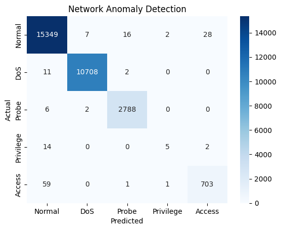

# Network Anomaly Detection using Random Forests

## 📌 Project Overview

This project presents a machine learning pipeline for **Network Anomaly Detection**, leveraging the power of **Random Forests** to identify malicious activities in network traffic. The system is trained on the refined **NSL-KDD** dataset and can perform both **binary** and **multi-class classification** of network intrusions.

The goal is to develop a model that not only flags anomalous behavior but also **categorizes specific attack types**, offering actionable insights for cybersecurity operations.

---

## 🧠 Problem Statement

Traditional security systems often fail to adapt to evolving threats. Anomaly detection provides a **data-driven approach** that learns normal network behavior and flags deviations, potentially catching zero-day attacks or subtle intrusions. However, accurate detection in high-dimensional data spaces remains a challenge.

This project addresses that challenge by:
- Applying a robust ensemble algorithm (Random Forest)
- Utilizing a curated dataset (NSL-KDD)
- Enhancing detection granularity through **multi-class labeling**

---

## 🔍 Dataset: NSL-KDD

The **NSL-KDD** dataset is a cleaned and balanced version of the KDD Cup 1999 dataset. It removes redundant instances and resolves class imbalance issues, making it ideal for evaluating anomaly detection models.

- **Data Composition:**
  - Normal Traffic
  - Malicious Activities categorized into four primary attack classes:
    - **DoS** (Denial of Service): `neptune`, `smurf`, etc.
    - **Probe** (Reconnaissance): `satan`, `ipsweep`, etc.
    - **Privilege Escalation**: `buffer_overflow`, etc.
    - **Access Attacks**: `guess_passwd`, etc.

---

## 🧪 Approach

### 1. **Preprocessing**
- Feature encoding (categorical to numerical)
- Normalization and feature scaling
- Label transformation for binary and multi-class tasks

### 2. **Modeling with Random Forest**
- **Bootstrapping**: Training multiple trees on random data samples
- **Feature Randomization**: Enhancing diversity and generalization
- **Voting Mechanism**:
  - **Binary**: Normal vs Attack
  - **Multi-class**: DoS, Probe, Privilege Escalation, Access

### 3. **Evaluation Metrics**
- Accuracy
- Precision, Recall, F1-Score
- Confusion Matrix
- ROC-AUC (for binary)

---

## 🛠️ Tech Stack

| Component      | Tool/Library         |
|----------------|----------------------|
| Language       | Python 3.x           |
| ML Model       | Random Forest (scikit-learn) |
| Data Handling  | Pandas, NumPy        |
| Visualization  | Matplotlib, Seaborn  |
| Dataset Source | NSL-KDD              |

---

## 📊 Results

- Robust detection of anomalies under both binary and multi-class settings.
- Reduced overfitting and improved generalization using Random Forests.
- Ability to distinguish among attack categories, not just binary anomaly detection.
Validation Set Evaluation:
Accuracy: 0.9950
Precision: 0.9949
Recall: 0.9950
F1-Score: 0.9949

Test Set Evaluation:
Accuracy: 0.9949
Precision: 0.9947
Recall: 0.9949
F1-Score: 0.9947

